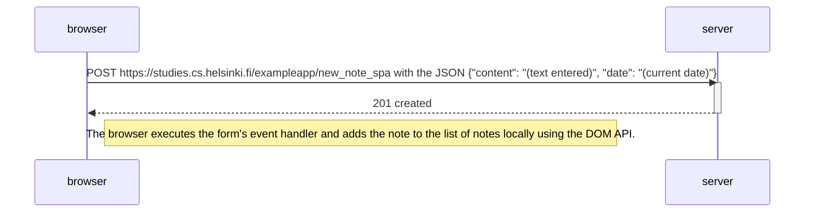

```mermaid
sequenceDiagram
    participant browser
    participant server

    browser->>server: POST https://studies.cs.helsinki.fi/exampleapp/new_note_spa with the JSON {"content": "(text entered)", "date": "(current date)"} 
    activate server
    server-->>browser: 201 created
    deactivate server

    Note right of browser: The browser executes the form's event handler and adds the note to the list of notes locally using the DOM API.
```
